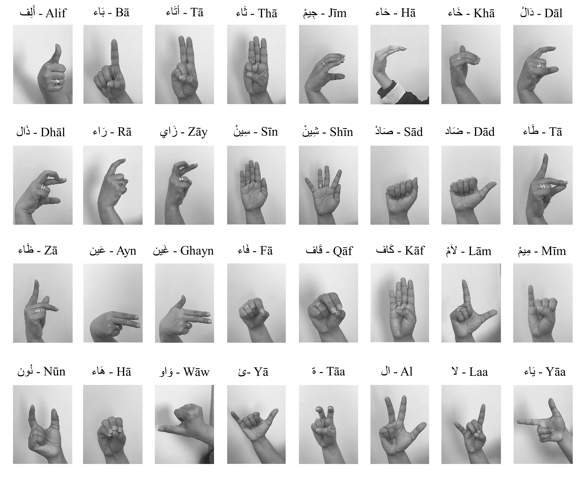
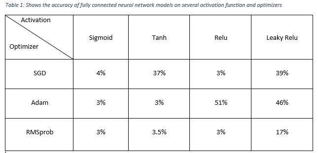
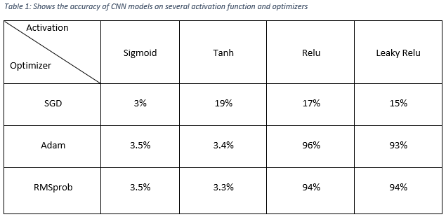

# Arabic Sign Language Classification

**Academic context:** This project was completed as part of the **Deep Learning course (CIS 735)** during my master's degree.

[](https://github.com/hailathamzeh/Arabic-sign-language-classification/actions/workflows/validate.yml)

The project investigates image classification of static Arabic Sign Language alphabet gestures. It compares fully connected neural networks with convolutional neural networks (CNNs), then studies how activation functions and optimizers affect learning behavior.

## Dataset

The project uses the [Arabic Alphabets Sign Language Dataset (ArASL)](https://data.mendeley.com/datasets/y7pckrw6z2/1), published through Mendeley Data. It contains 54,049 images collected from more than 40 people and covers 32 Arabic signs and alphabet classes. The official description notes that the number of images differs across classes.



**Figure 1.** Reference chart for the 32 static Arabic signs represented in ArASL. The chart helps connect each class label with its hand gesture. This image is supplied with the source dataset and is used under the dataset's CC BY 4.0 license.

### Download and arrange the data

Open the [Mendeley dataset page](https://data.mendeley.com/datasets/y7pckrw6z2/1) and download these two required files:

1. `ArASL_Database_54K_Final.zip`
2. `ArSL_Data_Labels.csv`

The page also provides `Signs_32_New.png`. A copy of that reference chart is already included in `assets/` for documentation.

Extract the image archive and arrange the required files exactly as follows:

```text
Arabic-sign-language-classification/
└── data/
    └── raw/
        ├── ArASL_Database_54K_Final/
        │   ├── class_folder_1/
        │   ├── class_folder_2/
        │   └── ...
        └── ArSL_Data_Labels.csv
```

The notebook searches all class folders under `ArASL_Database_54K_Final` and matches each image filename with the label CSV. Dataset files remain ignored by Git and should not be committed.

If the data is stored elsewhere, set `ARASL_DATA_DIR` to the folder containing both the extracted image directory and label CSV:

```powershell
# Windows PowerShell
$env:ARASL_DATA_DIR = "D:\datasets\ArASL"
```

```bash
# macOS or Linux
export ARASL_DATA_DIR="/path/to/ArASL"
```

## Method

The notebook implements the following workflow:

1. Discover image files from the 32 class folders.
2. Match image filenames to the official CSV labels.
3. Convert class names to numeric labels.
4. Shuffle and create a stratified 80/20 training-validation split using seed 123.
5. Resize images to 224 × 224 pixels and scale pixel values to `[0, 1]`.
6. Train fully connected and convolutional architectures.
7. Compare ReLU, sigmoid, tanh, and Leaky ReLU activations with SGD, Adam, and RMSprop.
8. Examine training and validation accuracy and loss curves.

## Recorded experiment results

The following figures summarize the results recorded during the original CIS 735 experiments. These values were not independently rerun while preparing this repository.

### Fully connected neural networks



**Figure 2.** Reported fully connected network accuracy across activation and optimizer combinations. ReLU with Adam produced the strongest entry in this comparison at approximately 51%. The dense models flatten every image, which removes explicit spatial structure and helps explain why they were substantially weaker than the CNNs.

The deeper ReLU-Adam dense model preserved in the notebook finished with 51.71% training accuracy and 55.46% validation accuracy after 10 epochs.

### Convolutional neural networks



**Figure 3.** Reported CNN accuracy across the same activation and optimizer combinations. ReLU with Adam produced the highest recorded training accuracy at approximately 96%, while ReLU with RMSprop and Leaky ReLU with RMSprop also performed strongly in the comparison table.

The preserved ReLU-Adam CNN run finished with 96.23% training accuracy and 92.27% validation accuracy after five epochs. The difference between training and validation performance should be considered when interpreting the comparison.

## Repository structure

```text
.
├── assets/
│   ├── arabic_signs_reference.png
│   ├── cnn_accuracy.png
│   └── fully_connected_accuracy.png
├── data/
│   └── README.md
├── notebooks/
│   └── arabic_sign_language_classification.ipynb
├── tools/
│   └── validate_repository.py
├── .gitignore
└── requirements.txt
```

## Setup

Python 3.11 is recommended.

```bash
git clone https://github.com/hailathamzeh/Arabic-sign-language-classification.git
cd Arabic-sign-language-classification
python -m venv .venv
```

Activate the environment:

```powershell
# Windows PowerShell
.venv\Scripts\Activate.ps1
```

```bash
# macOS or Linux
source .venv/bin/activate
```

Install the dependencies:

```bash
python -m pip install --upgrade pip
python -m pip install -r requirements.txt
```

After arranging the dataset, launch Jupyter from the repository root:

```bash
jupyter lab
```

Open `notebooks/arabic_sign_language_classification.ipynb` and run the cells in order. Training all model combinations is computationally expensive, so a GPU environment is recommended.

## Reproducibility and limitations

- The original notebook was created in a Python 3.7 course environment. Imports and removed pandas operations were updated for the Python 3.11 environment documented here.
- The random seed and stratified split are fixed, but TensorFlow results can still vary by hardware, backend, and library version.
- The reported numbers are validation results from the original split, not results from an independent test set.
- A subject-independent split is not documented in the original work, so the results should not be interpreted as verified generalization to unseen signers.
- The source dataset is class-imbalanced, and the original comparison primarily reports accuracy.

## Dataset citation

Latif, G., Alghazo, J., Mohammad, N., AlKhalaf, R., & AlKhalaf, R. (2018). *Arabic Alphabets Sign Language Dataset (ArASL)*. Mendeley Data, Version 1. [https://doi.org/10.17632/y7pckrw6z2.1](https://doi.org/10.17632/y7pckrw6z2.1)

The ArASL dataset is distributed under the [Creative Commons Attribution 4.0 International license](https://creativecommons.org/licenses/by/4.0/). The dataset license applies to the dataset and its reference image, not automatically to the project code.
